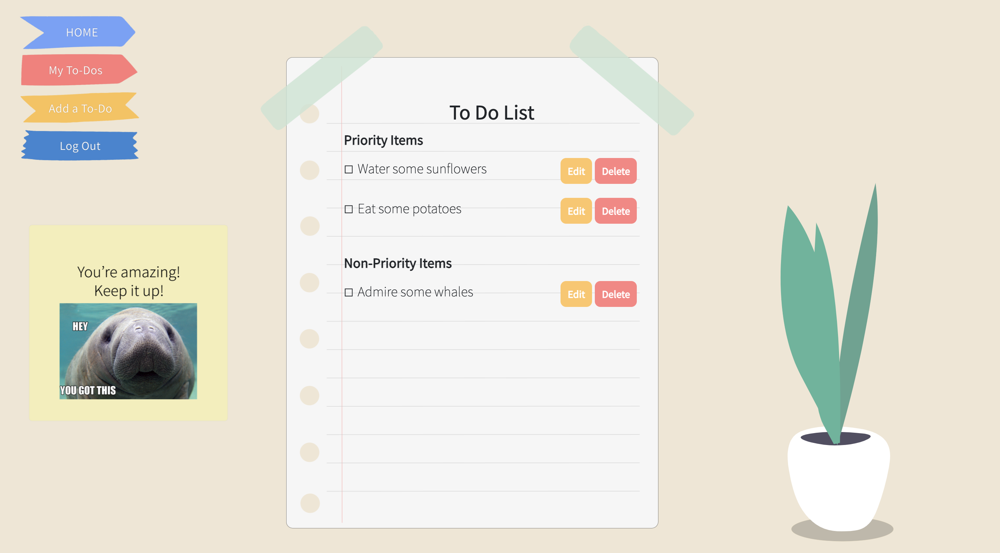
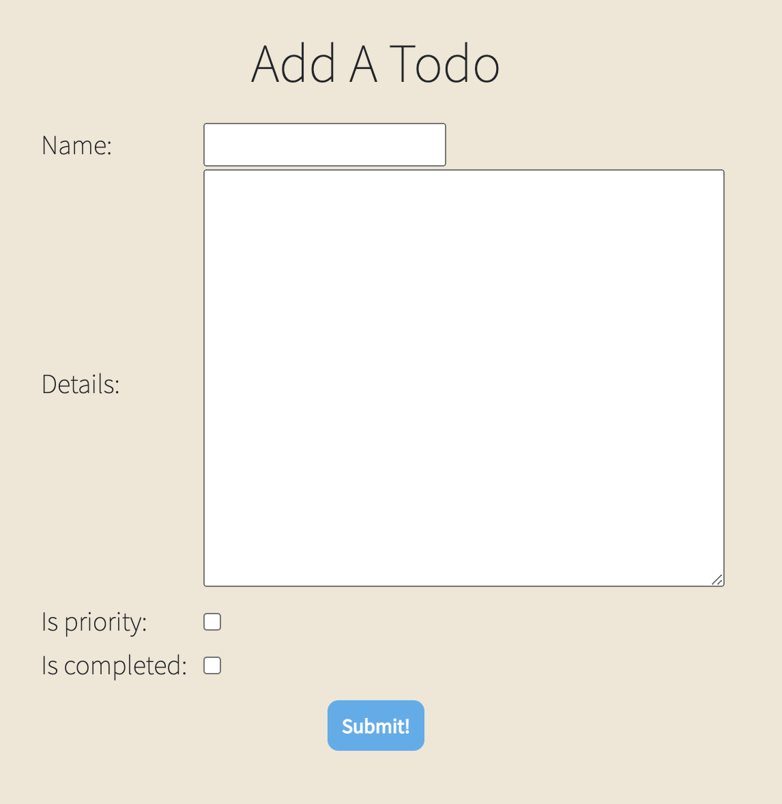
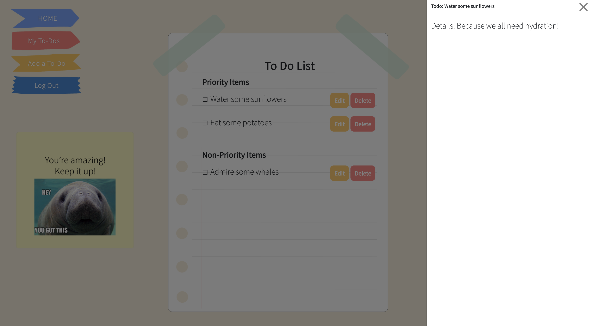

# :seedling: yooDoo To-Do App

A simple to-do app to help keep you in the right mindset to tackle all of your daily tasks. Due tomorrow? Do today! You've got what it takes to tough it through your to-dos. 

Sign in and add your to-dos! Then feel the satisfaction of crossing them off as you go. Work hard, but also don't forget to take breaks to increase your productivity!

---
## :point_right: [Try Me Out!](https://christinew2-unit4.herokuapp.com/)
---
## :blush: Additional Application Screenshots
 

---
## :star: Technologies Used 
- HTML
- CSS
- Python
- Django
- Bootstrap
- Git / GitHub
- LottieFiles 
- Adobe Photoshop

---
## :bulb: Check Out the Journey Here
- [Trello Board](https://trello.com/b/503BvtG0/unit-4-project)
- [Wireframes](https://whimsical.com/unit-4-wireframe-PkHFH659GsZzuqJSxCrwrm)
- [Entity Relationship Diagram (ERD)](https://whimsical.com/unit-4-erd-HanEdZayQJ2BB7gUvXVR1n)
---
## :ice_cube: IceBox (Next Steps) 
- [ ] Dark Mode
- [ ] Add option to replace side sticky note with a pomodoro timer 
- [ ] Ability to move tasks around
- [ ] More styling for form pages
- [ ] For scaling up: add calendar view, view past and future dates
- [ ] For scaling up: refactor as bullet journal

---
## :yellow_heart: Attributions
- Icons from www.flaticon.com. Vectors created by Macrovector, Rawpixel.com, & Icon54.com
- "Assistant" font by Google Fonts
- Navigation bar animation by https://ianlunn.github.io/Hover/
- Homepage & Index Page Animations from [Lottie](https://lottiefiles.com/)
- [Calming Manatee Meme](https://www.sadanduseless.com/calming-manatee/)